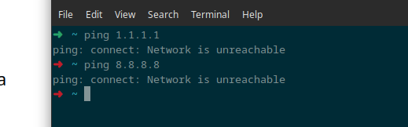
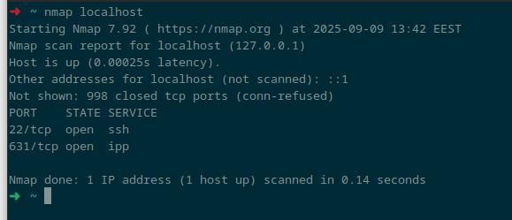
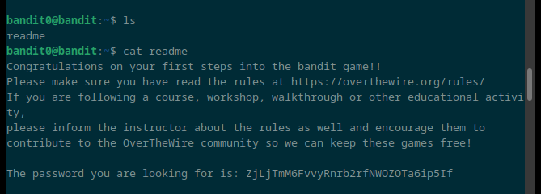
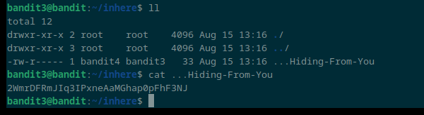
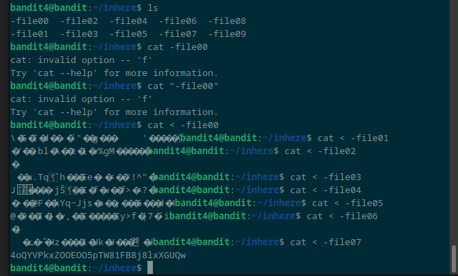

# X)

- To create a new directory, you can use the **mkdir** command
- You can navigate through files and directories using commands like **pwd**, **ls**, and **cd**
- In Linux, many tasks can be done with simple commands
- If you need help or want to see a list of options for a command, use **man ls**

# A)
  
doesn't work since not connected

# B)
  
even if i'm not connected to the network it works because it's my local address

# C)
with a server open like with daemon when you scan again you have a new open port

# D)

