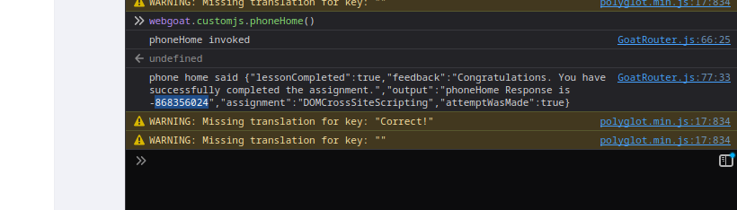
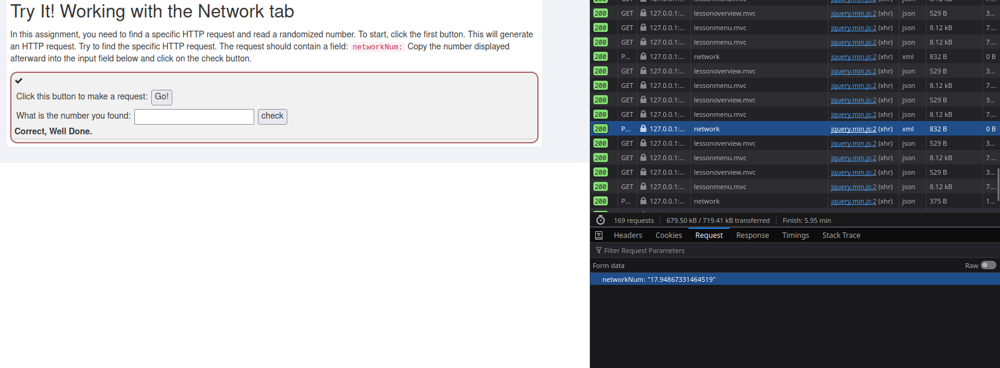
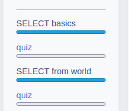

# X)
## A01:2021 — Broken Access Control

- Users can access functionality or data they’re not supposed to
- Common causes: missing or inconsistent authorization checks, insecure direct object references (changing an ID in the URL), excessive permissions granted to endpoints.
- Impact: data leakage, privilege escalation, complete account takeover in worst cases.

## A05:2021 — Security Misconfiguration

- Misconfigured servers, frameworks, containers, or apps (default credentials left in place, verbose error messages, unused services exposed).
- Examples: exposed admin panels, directory listings enabled, overly permissive CORS, default accounts not removed.
- Impact: gives attackers easy footholds or reveals information that helps more serious attacks.

## A06:2021 — Vulnerable and Outdated Components

- Using libraries, frameworks, plugins, or containers with known vulnerabilities (unpatched dependencies).
- Examples: an old JS library with an RCE bug, CMS plugin with SQLi, outdated OS packages.
- Impact: attackers exploit known CVEs to pivot into systems or run remote code.


## A03:2021 — Injection

- Attacker-supplied data is interpreted as code/commands (SQL, OS commands, LDAP, XPath, etc.).
- Example: SQL injection where user input breaks out of a string and alters the query logic (`' OR '1'='1`), or command injection via unsanitized shell parameters.
- Impact: data exfiltration, tampering, authentication bypass, remote code execution.

## xkcd 327 — “Exploits of a Mom”

- A humorous comic that lists silly “exploits” a mom uses in daily life — a metaphor showing that exploitation often means noticing unexpected quirks and using them.
- The comic highlights that “hacking” is often creative problem-solving applied to systems that weren’t designed to handle weird inputs/uses.


# A)
I've installed it

# B)

you used the console to call the function and write the number for the first exercice 

and for the second one you do a request and you look at it in the network page 
# C) 
done

# D)


done it

# E)

on the burp suite we put ``` 'OR 1=1--```  instead of ``` Gifts ``` to make everything appear

