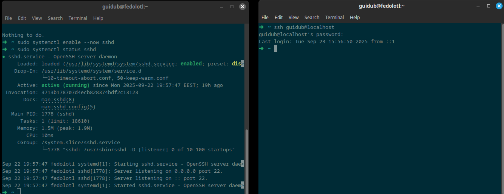
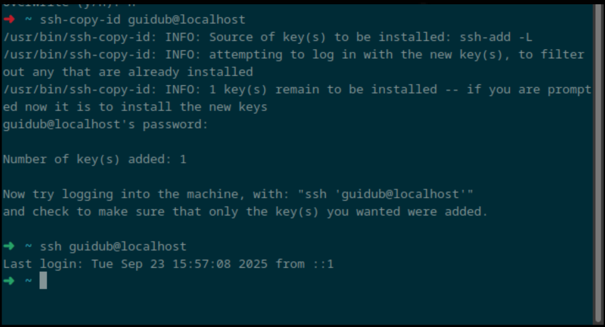
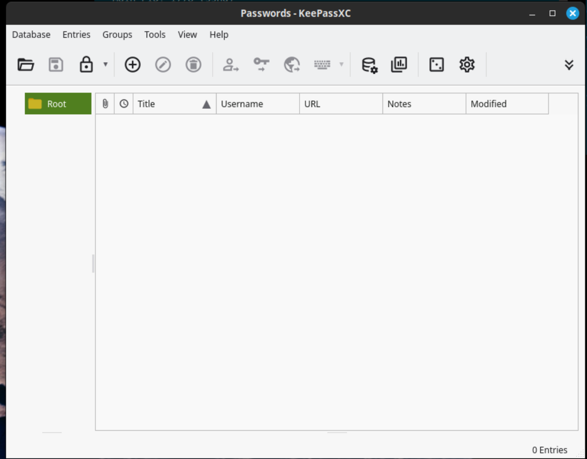

# X) 
### Schneier 2015 – _Applied Cryptography: Foundations_

- Goals: confidentiality, integrity, authenticity, non-repudiation
- Symmetric (same key) vs. asymmetric (public/private key) cryptography
- Tools: encryption, digital signatures, hash functions
- Kerckhoffs’s principle: security must not rely on secret algorithms
- Applications: networks, financial transactions, secure emails
### Karvinen 2023 – _PGP with gpg_

- PGP = asymmetric encryption (public/private keys)
- Steps: generate key → import public key → encrypt → decrypt → sign
- Provides: confidentiality, authenticity, integrity

# A)
i've installed it and connect

# B)

i've put an ssh key and now i can connect directly

# C)

i will redo it because i will change my PC but i will certainly use keepassXC because it's simple and secure