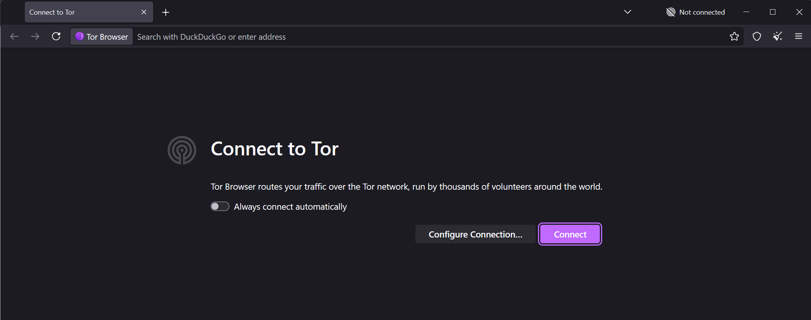
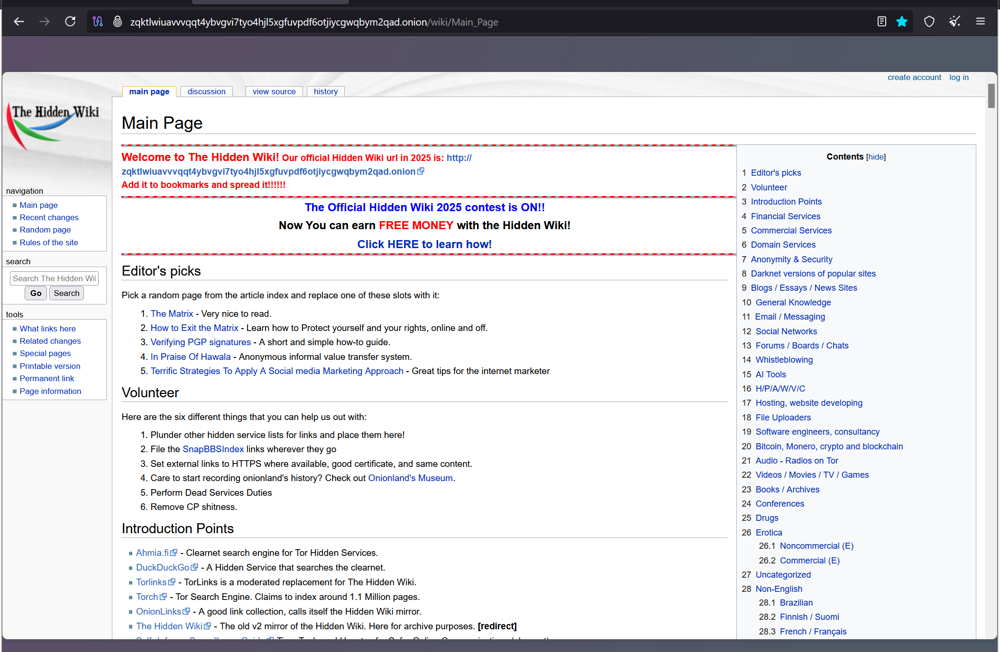
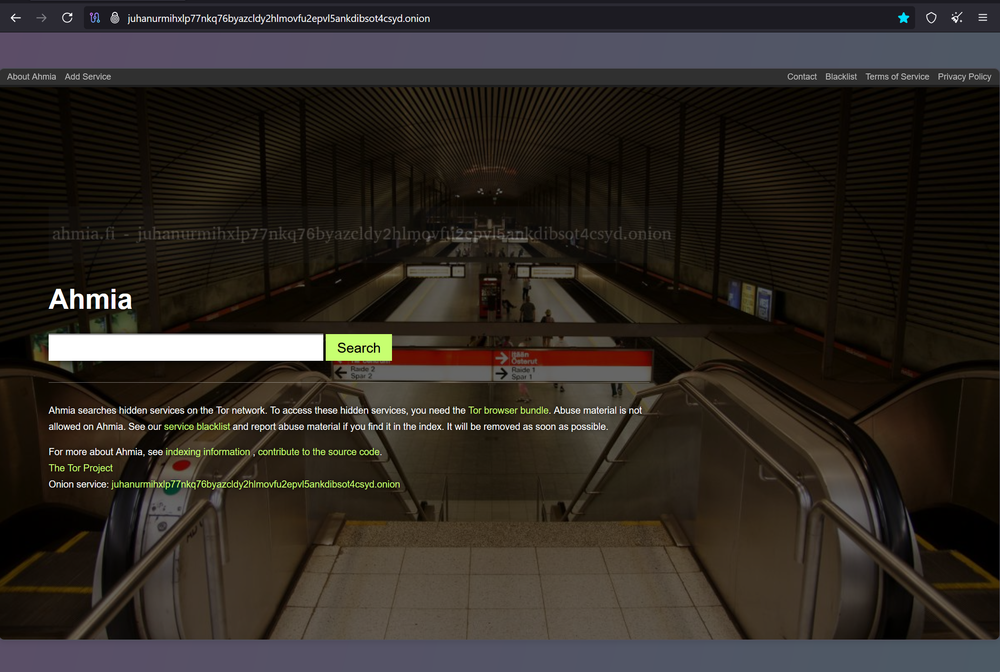
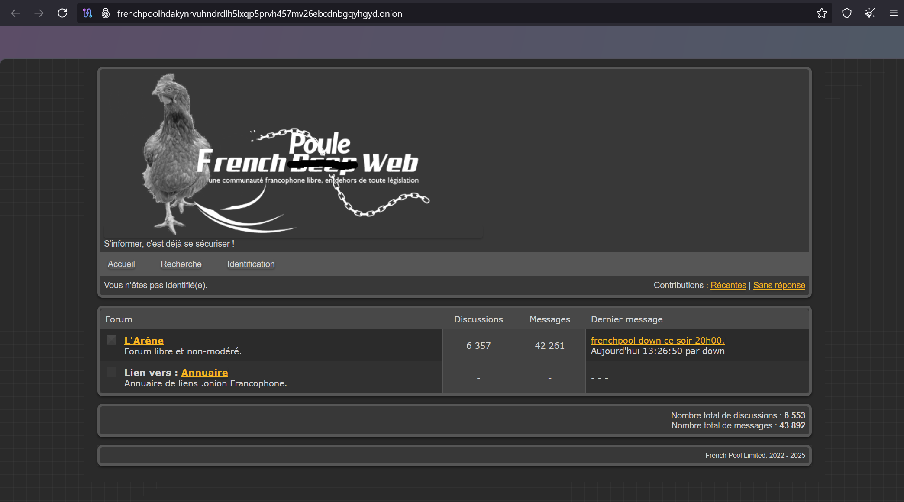
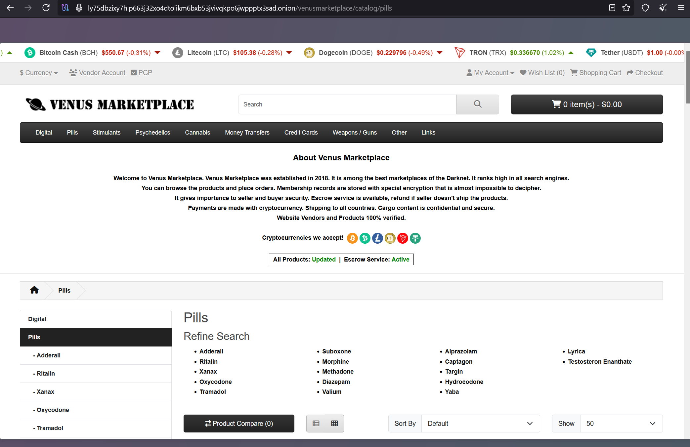

# X)
### 7 things about tor
 1. Tor Still Works
 2. Tor is Not Only Used by Criminals
 3. Tor Does Not Have a Military Backdoor
 4. No One in the US Has Been Prosecuted For Running a Tor Relay
 5. Tor is Easy to Use
 6. Tor is Not as Slow as You Think
 7. Tor is Not Foolproof

### Hiding Behind the Keyboard

- **Tor anonymizes Internet traffic**, making user tracking very difficult.
- **Bypassing Tor’s anonymity is nearly impossible** for investigators.
- **Forensic value lies in artifacts left behind**, not the communication itself.

# A) 

now we need to connect to the Tor network that we need to search for onion website

# B)
to search for onion web site we need to know them or access them in website like the hiddenwiki that is a wiki with many website in .onion

Or you can search directly in a search engine like Ahmia

You can go to some forum like the frenchpool, it's a random french forum that i found

there is some marketplace like silkroad but it close some times ago but there a many marketplace like venux marketplace that sell many thing like drugs, weapons, pills, etc.

there are many well known organization that has a physical street adress like facebook, The New York Times or propublica for exemple here i take propublica (this is a nonprofit investigative journalism organization based in New York City)

