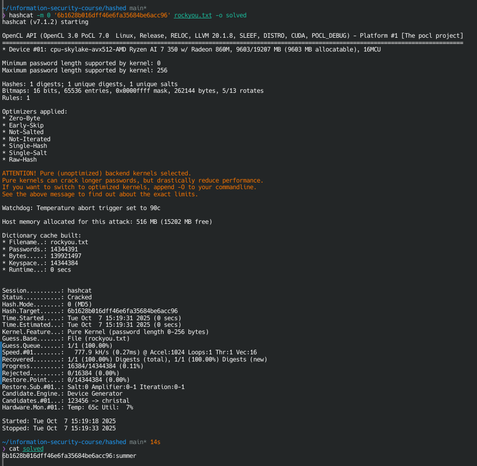
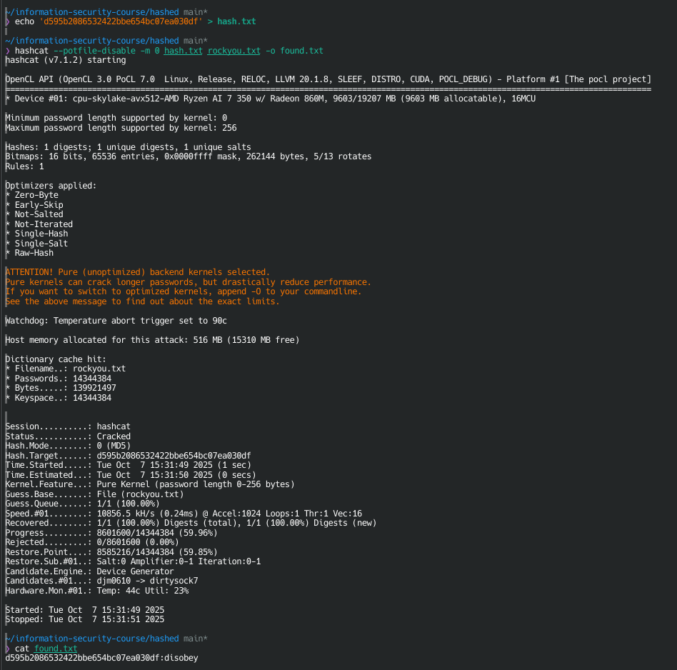

# X)
- A **protocol** is a sequence of steps involving **two or more parties** to achieve a task.
- All **steps must be followed in order** and by **agreement** of all parties.
- A protocol must have a **clear goal**—otherwise, it's not a real protocol.
- **Everyone involved** must know and agree on the protocol beforehand.
# A)

i install hashcat and test it on rockyou.txt
# B)

Here i crack the hash "d595b2086532422bbe654bc07ea030df" by putting it in a file and i crack it with hashcat and the rockyou.txt wordlist, then i cat the found.txt fil to show the cracked password (I used the `--potfile-disable` flag in Hashcat to bypass the existing potfile entries and run the cracking commands cleanly from scratch)